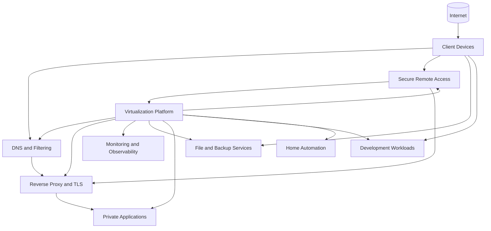

# Homelab Architecture Overview

## Purpose

This document provides a sanitized architectural view of the homelab represented in this repository. It is intentionally descriptive rather than exhaustive.

Exact IP addressing, credentials, private DNS names, externally reachable endpoints, guest identifiers, access-policy details, backup placement, and unnecessary implementation fingerprints are excluded.

## High-level architecture

The environment is centered on a Proxmox VE virtualization platform hosting dedicated infrastructure and application workloads.

This diagram intentionally shows functional domains rather than the complete live host and dependency map.

## Core infrastructure domains

### Virtualization

Proxmox VE provides guest lifecycle management, console access, storage management, snapshots, and guest integration for supported virtual machines and containers.

The virtualization management interface is treated as private administrative infrastructure. Remote administration uses the secure overlay network rather than public exposure through the application reverse proxy.

### File and backup services

Dedicated storage services support internal file access and selected application recovery workflows.

File services remain local to the home network. Host-level filtering limits service reachability to intended local and monitoring paths, while share access is constrained with dedicated service identities and explicit permissions.

Authoritative source data and rebuildable application indexes are treated as separate recovery domains where practical. Public documentation avoids publishing exact dataset placement, mount relationships, backup target names, or physical storage topology.

### Monitoring and observability

Checkmk provides infrastructure and service-state monitoring, while Prometheus and Grafana provide time-series metrics and visualization.

Monitoring application health is validated independently of operating-system package state. The monitoring platforms themselves are also treated as managed infrastructure with backup and recovery requirements.

Grafana is presented through centralized HTTPS, while Prometheus remains a backend service used through internal service-to-service connectivity rather than a normal client-facing listener.

### DNS and filtering

A dedicated internal DNS and filtering service provides local resolution and selected split-DNS behavior.

Internal service names can resolve to the reverse proxy where centralized HTTPS presentation is useful. Public documentation omits the live naming scheme and address assignments.

### Reverse proxy and TLS ingress

A dedicated unprivileged Linux workload hosts Nginx as the centralized reverse proxy and TLS termination layer for selected private web applications.

A wildcard certificate is issued through ACME DNS challenge validation. Private key material and DNS-provider credentials remain isolated from backend applications and outside source control.

Service migration was performed incrementally so application routing, trusted-proxy behavior, authentication, WebSocket connectivity, and direct-backend restrictions could be validated before broader adoption.

Only workloads with a current publication requirement use the reverse proxy. Development applications remain outside centralized ingress while they are LAN-only.

### Secure remote access

A dedicated Linux workload provides Tailscale subnet routing for authenticated encrypted remote access.

The design separates remote network reachability from application presentation:

* Tailscale provides authenticated private network access where remote access is required.
* Nginx provides named HTTPS presentation for selected private applications.
* Administrative services remain private and use explicit remote-access policy.
* Backend-only and LAN-only services remain local unless a documented requirement changes.

The access policy follows a deny-by-default model. Validation includes both permitted and denied paths from an external network.

See [`../networking/tailscale-remote-access.md`](../networking/tailscale-remote-access.md).

### Home automation

Home Assistant runs as a dedicated appliance-style workload with local and cloud-connected integrations.

Updates, backups, and application validation are handled according to the appliance model rather than generic Linux maintenance assumptions.

Home Assistant is presented through centralized HTTPS and validates the expected reverse-proxy source before accepting forwarded client information.

### Development and private applications

Development workloads include database-backed services and internal tools.

The Software Asset Management application and personal knowledge and RAG application remain under development and are currently accessed only from the home LAN. They are not published through Nginx or Tailscale until a real publication or remote-access requirement exists.

Databases and other backend components remain private unless direct remote administration is explicitly required.

### Personal knowledge and retrieval platform

A dedicated Linux workload provides the backend foundation for a private-first personal knowledge and retrieval system.

The design keeps source Markdown authoritative while treating database indexes, embeddings, and retrieval state as rebuildable derived data. Source content and derived state are protected through separate recovery considerations.

### Deferred media services

Media hosting is currently deferred until dedicated storage infrastructure is available and the storage architecture can be designed around that workload.

## Operational design principles

The environment follows several recurring principles:

1. **Inventory before maintenance.** Reconcile the current guest inventory before maintenance so newer workloads are not omitted from older procedures.
2. **Application validation matters.** Package-manager success is not sufficient evidence that a hosted service is healthy.
3. **Separate rollback layers.** Guest snapshots, application backups, database exports, and secondary copies address different failure modes.
4. **Prefer dedicated service identities.** Machine-to-machine integrations use purpose-specific credentials where practical.
5. **Keep public documentation sanitized.** Explain engineering decisions without publishing a useful attack map or recovery map.
6. **Separate deterministic and dynamic automation.** Predictable schedules and state-dependent automation are handled independently where that improves clarity.
7. **Keep source data independent of derived indexes.** Rebuildable search or retrieval state should not become the only copy of important information.
8. **Centralize ingress deliberately.** Reverse proxy and certificate responsibilities are isolated from backend applications.
9. **Separate remote access from application ingress.** Administrative reachability and HTTPS presentation are different responsibilities.
10. **Do not expand access without a requirement.** LAN-only development and backend services remain local until remote access or publication is actually needed.
11. **Validate denied paths.** Security controls are tested for both intended access and intended restriction.

## Backup model

The public architecture describes recovery principles rather than the exact live backup topology.

The environment uses a combination of:

* scheduled guest backups
* short-lived snapshots for selected maintenance
* application-native backups
* logical database exports where appropriate
* persistent application data
* secondary copies for selected workloads

Backup creation and recoverability are treated as separate validation problems. Controlled restore testing is used to prove recovery behavior where practical.

Exact schedules, retention values, storage locations, physical disk relationships, workload-to-job mappings, and known shared failure domains are intentionally omitted from the public repository.

See [`../backup-recovery/README.md`](../backup-recovery/README.md) for the sanitized recovery model.
